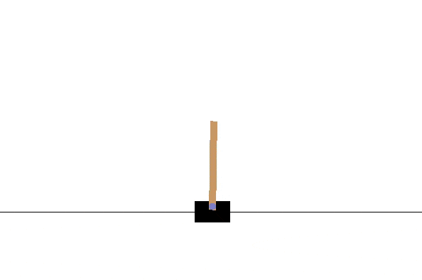

<p align="center">
    
</p>
<p align="center">
    
    
</p>

Reinforcement learning framework based on Pytorch for implementing custom deep learning models
on custom environments using state of the art and modular reinforcement learning algorithms

# Installation

Lazaro package is available on PyPI for Python version greater or equal to 3.7.
```shell
pip install lazaro
```

# Usage
```python
import torch
import torch.nn.functional as F
import lazaro as lz

env = lz.environments.CartPole()


class CustomNN(torch.nn.Module):
    def __init__(self):
        super(CustomNN, self).__init__()
        self.linear = torch.nn.Linear(4, 30)

    def forward(self, x):
        return F.relu(self.linear(x))


class CustomAgent(lz.agents.explorers.NoisyExplorer,
                  lz.agents.replay_buffers.NStepsPrioritizedReplayBuffer,
                  lz.agents.loggers.TensorBoardLogger,
                  lz.agents.DoubleDuelingDqnAgent):
    def model_factory(self):
        return CustomNN()


agent = CustomAgent(action_space=2)
agent.train(env)

```
<p align="center">
    
</p>