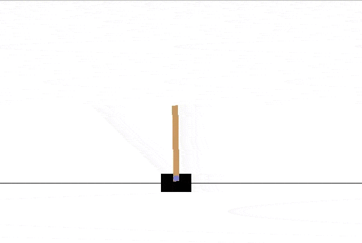
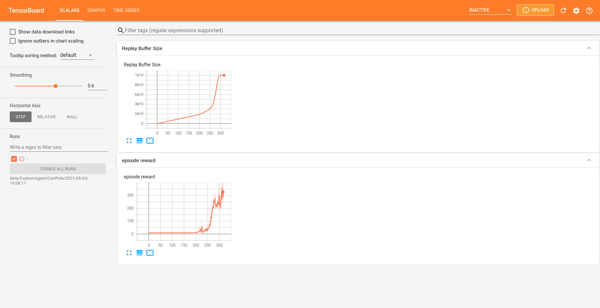
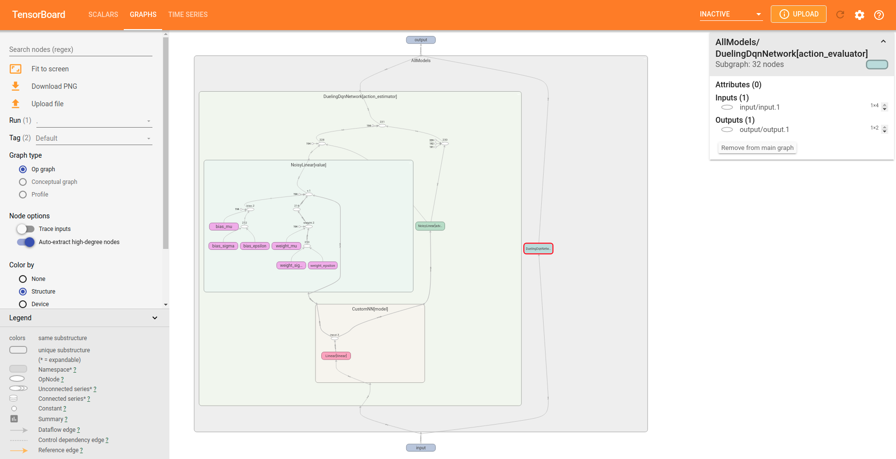

<p align="center">
    
</p>
<p align="center">
    
    
</p>

Reinforcement learning framework based on Pytorch for implementing custom deep learning models
on custom environments using state of the art and modular reinforcement learning algorithms.

Developing deep learning models is hard enough to also be worrying about implementing them
correctly in the last reinforcement learning algorithm you saw in a paper. Lazaro takes that weight
out of the shoulders of the people who work with reinforcement learning, and let developers focus
on their custom deep learning models that solve their custom environments.

# Installation

Lazaro package is available on PyPI for Python versions greater or equal to 3.7.
```shell
pip install lazaro
```

# Usage
Import torch and lazaro packages
```python
import torch
import torch.nn.functional as F
import lazaro as lz
```

Choose an environment to train your model. You can create one yourself or choose one from the 
environments repository. [Here is a cool tutorial](docs/SNAKE_ENV.md) that shows how to build an
environment yourself from scratch.
```python
env = lz.environments.CartPole()
OBSERVATION_SPACE = 4  # position, speed, angle, rotation speed 
ACTION_SPACE = 2  # move right, move left
```

Create your custom model using PyTorch.

```python
class CustomModel(torch.nn.Module):
    def __init__(self):
        super(CustomModel, self).__init__()
        # your last layer can have an arbitrary number of output neurons, 
        # lazaro will handle the rest of the model for you
        self.linear = torch.nn.Linear(OBSERVATION_SPACE, 128) 

    def forward(self, x):
        return F.relu(self.linear(x))
```
Create your agent. You can select any agent and mix it with any exploration policy and any replay buffer
algorithm.
```python
# mix any agent with any exploration policy and any replay buffer
class CustomAgent(lz.agents.explorers.NoisyExplorer,
                  lz.agents.replay_buffers.NStepsPrioritizedReplayBuffer,
                  lz.agents.DoubleDuelingDqnAgent):  
    
    # implement the model factory. It will be used to embed your torch model into the agent
    def model_factory(self):
        return CustomModel()
    
    # lazaro expects to receive data as torch.Tensor
    def preprocess(self, x):  # x is the raw state that the environment returns
        return torch.from_numpy(x.astype("float32"))
```
Instantiate your agent and train it in your environment.
```python
agent = CustomAgent(action_space=ACTION_SPACE)
agent.train(env)
```

<p align="center">
    
</p>

## Custom snake game environment
If you want to know how to create your own environment, checkout [this tutorial](docs/SNAKE_ENV.md), where you will build
the snake game from scratch in a few lines of code and train an agent on it

## Tensorboard integration
You can visualize the learning progress and the agent's neural network graph using Tensorboard.
It's very simple:
```python
class CustomAgent(lz.agents.explorers.NoisyExplorer,
                  lz.agents.replay_buffers.NStepsPrioritizedReplayBuffer,
                  lz.agents.loggers.TensorBoardLogger,  # <- Just add this, and voila!
                  lz.agents.DoubleDuelingDqnAgent):  
    
    def model_factory(self):
        return CustomModel()
    
    def preprocess(self, x):
        return torch.from_numpy(x.astype("float32"))
```
Once the training has started, you can go to the Tensorboard local uri (http://localhost:6006) and see useful info
like this:
<p align="center">
    
    
</p>
