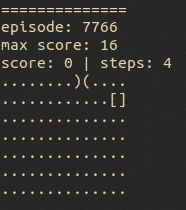

# Custom snake game environment

In the snake game, the player moves the snake through a two-dimensional board eating randomly positioned 
apples. Each time the snake eats an apple, it grows one unit. As it moves forward, it leaves a trail behind that 
represent the snake itself. The longer the snake is, the harder the game will be. The objective is to eat as many apples
as possible before crashing.

## Coding the snake game

Start by installing lazaro package with pip.

```shell
pip install lazaro
```

Import all the dependencies.

```python
import random
import typing as T
import lazaro as lz
import torch
import torch.nn.functional as F
```

Let's start by declaring a base class that represents any object in the game...

```python
class GameObject:
    def __init__(self):
        self.position: T.Optional[T.Tuple[int, int]] = None

    def set_position(self, position: T.Tuple[int, int]):
        self.position = position
```

and then make the game objects, the snake and the apple:

```python
class Snake(GameObject):
    HEAD = 1  # these are identifiers for populating the game's board, 
    TAIL = 2  # 0 if there is an empty cell, 1 if there is a head in it, etc...

    def __init__(self):
        super(Snake, self).__init__()
        # the tail is represented with an array of relative coordinates
        self.tail: T.List[T.Tuple[int, int]] = []

    def shift_tail(self, direction: T.Tuple[int, int]):
        # if the snake moves without eating the apple, shift the tail
        self.tail.insert(0, direction)
        self.tail.pop()

    def grow_tail(self, direction: T.Tuple[int, int]):
        # if the snake eats the apple, then the tail must grow
        self.tail.insert(0, direction)

    def clear_tail(self):
        self.tail.clear()


class Apple(GameObject):
    APPLE = 3
    
```
Those are all the objects we need, lets build the snake game environment!

For that we must inherit from ```lz.environments.Environment``` interface, and implement all
the missing methods so that lazaro can use it to train an agent.
```python
class CustomEnv(lz.environments.Environment):
    def reset(self) -> StateType:
        # reset the game and return the state after the reset

    def step(self, action: int) -> T.Tuple[StateType, float, bool]:
        # the core of the game, based on a received action, return the new state, the reward and a 
        # boolean that tells if the game has ended

    def render(self) -> None:
        # for visualizing the game. Here, there will only be prints

    def close(self) -> None:
        # what to do to close the game, we dont want to do nothing in particular in this case
```
Now we know how to build a custom environment.

This is the constructor for the snake game, with all the constants and the initial state:
```python
class SnakeEnv(lz.environments.Environment):
    CHANNELS = 4
    SHAPE = (5, 5)
    RENDER_MAP = {
        0: "..",
        1: "[]",
        2: "{}",
        3: ")("
    }
    ACTION_TO_DIRECTION = {
        0: (0, -1),
        1: (-1, 0),
        2: (0, 1),
        3: (1, 0)
    }
    REWARD_CRASH = -1  # the negative reward if the snake dies
    REWARD_EAT = 1  # the positive reward if the snake eats an apple
    HUNGER_LIMIT = 40  # how hungry the snake can be before dying

    def __init__(self):
        self.snake = Snake()
        self.apple = Apple()
        self.eaten = 0  # how many apples the snake has eaten in current episode
        self.hunger = 0  # how hungry is the snake, if it reaches HUNGER_LIMIT, it will die
        self.steps = 0  # steps in this episode
        self.max_score = 0  # overall maximum score (apples eaten in an episode)
        self.episode = 0  # total episodes played
```
We will create a helper method for generating the state of the game, which will be a two-dimensional array where the
values represent the content of each cell, (0 if cell is empty, 1 if there is a snake's head, 2 if there is a piece 
of the tail and 3 if there is an apple):
```
[[0, 0, 0, 0, 0],
 [0, 1, 0, 3, 0],
 [0, 2, 0, 0, 2],
 [0, 2, 2, 0, 2],
 [0, 0, 2, 2, 2]]
```
```python
    def _render_state(self):
        # generate empty board
        state = [[0 for _ in range(self.SHAPE[0])] for _ in range(self.SHAPE[1])]
        # position the snake in the board
        if self.snake.position:
            snake_head = self.snake.position
            state[snake_head[0]][snake_head[1]] = Snake.HEAD  # place the head of the snake on the board
            snake_point = snake_head
            for tail_direction in self.snake.tail:  # place all the tail
                snake_point = snake_point[0]-tail_direction[0], snake_point[1]-tail_direction[1]
                state[snake_point[0]][snake_point[1]] = Snake.TAIL
        # position the apple in the board
        if self.apple.position:
            state[self.apple.position[0]][self.apple.position[1]] = Apple.APPLE

        return state
```
Another helper method is also used for retrieving an empty random position, so that
we can randomly position the snake and the apple at the start without overlapping them.
```python
    def _random_position(self):
        state = self._render_state()
        new_position = (random.randint(0, self.SHAPE[0] - 1), random.randint(0, self.SHAPE[1] - 1))
        # if there is something in the randomly selected position iterate until find an empty one
        while True:
            if state[new_position[0]][new_position[1]] == 0:
                return new_position
            new_position = (random.randint(0, self.SHAPE[0] - 1), random.randint(0, self.SHAPE[1] - 1))
```
The reset method is used for resetting the environment whenever the game is finished, it must also return the initial state
```python
    def reset(self) -> T.List[T.List[int]]:
        self.episode += 1
        self.eaten = 0
        self.hunger = 0
        self.steps = 0
        self.snake.clear_tail()
        self.snake.set_position(self._random_position())
        self.apple.set_position(self._random_position())
        return self._render_state()
```
The step method is the most important and complex method of the environment, the one that defines the rules. 
This is the idea:
- based on the action taken by the agent, get the new position of the snake's head
- check if it has gone out of limits or if it has crashed with his own tail, if that happens, 
  finish the game and return a bad reward
- check if the snake has eaten the apple, if true, return a good reward, grow the snake's tail, 
  and randomly position the apple in a new empty cell
- check if it has starved, and if it does, finish the game and return a bad reward
- if none of the above has happened, just move the snake without growing the tail
```python
    def step(self, action: int) -> T.Tuple[T.List[T.List[int]], float, bool]:
        self.steps += 1
        new_snake_position = (self.ACTION_TO_DIRECTION[action][0]+self.snake.position[0],
                              self.ACTION_TO_DIRECTION[action][1]+self.snake.position[1])

        # if snake has gone out of limits
        if not (0 <= new_snake_position[0] < self.SHAPE[0] and 0 <= new_snake_position[1] < self.SHAPE[1]):
            return self._render_state(), self.REWARD_CRASH, True

        # if snake has crashed with her own tail
        prev_state = self._render_state()
        new_cell_content = prev_state[new_snake_position[0]][new_snake_position[1]]
        if new_cell_content == Snake.TAIL:
            return prev_state, self.REWARD_CRASH, True

        # if snake has stepped into the apple
        elif new_cell_content == Apple.APPLE:
            self.snake.grow_tail(self.ACTION_TO_DIRECTION[action])
            self.snake.set_position(new_snake_position)
            self.apple.set_position(self._random_position())
            self.eaten += 1
            self.max_score = max(self.max_score, self.eaten)
            self.hunger -= self.HUNGER_LIMIT  # the more the snake eats, the less hungry it is
            return self._render_state(), self.REWARD_EAT, False

        # if snake has made a normal step
        else:
            self.snake.shift_tail(self.ACTION_TO_DIRECTION[action])
            self.snake.set_position(new_snake_position)
            self.hunger += 1
            if self.hunger > self.HUNGER_LIMIT:  # if has starved to death
                return self._render_state(), self.REWARD_CRASH, True
            else:
                return self._render_state(), 0, False
```
Also, a way of visualizing how the snake is performing is great.
```python
    def render(self) -> None:
        p = "="*self.SHAPE[1]*2+"\n"
        p += f"episode: {self.episode} max score: {self.max_score}\n"
        p += f"score: {self.eaten} | steps: {self.steps}\n"
        for row in self._render_state():
            for cell in row:
                p += self.RENDER_MAP[cell]
            p += "\n"
        print(p)
```
We don't have to anything in particular for closing the environment
```python
    def close(self) -> None:
        pass
```
## Building the agent
Nice! We have just made the snake game from scratch, now lets build an agent to play it.

First, we will define our custom neural network model using PyTorch library
```python
class CustomNN(torch.nn.Module):
    def __init__(self):
        super(CustomNN, self).__init__()
        self.conv1 = torch.nn.Conv2d(SnakeEnv.CHANNELS, 16, kernel_size=(3, 3), padding=(1, 1))
        self.conv2 = torch.nn.Conv2d(self.conv1.out_channels, 32, kernel_size=(3, 3), padding=(1, 1))
        self.linear = torch.nn.Linear(self.conv2.out_channels * SnakeEnv.SHAPE[0] * SnakeEnv.SHAPE[1], 512)

    def forward(self, x):
        batch_size = x.shape[0]
        x = F.relu(self.conv1(x))
        x = F.relu(self.conv2(x))
        x = torch.reshape(x, (batch_size, -1))
        return F.relu(self.linear(x))
```
Now, lets embed this model into a reinforcement learning agent.
```python
class CustomAgent(lz.agents.explorers.NoisyExplorer,
                  lz.agents.replay_buffers.NStepsPrioritizedReplayBuffer,
                  lz.agents.DoubleDuelingDqnAgent):
    def model_factory(self):
        return CustomNN()
  
    def preprocess(self, x):
        # we need special preprocessing for this environment for transforming the last dimension,
        # which is the game object index (0, 1, 2 or 3) into a categorical array ((1,0,0,0), (0,1,0,0), (0,0,1,0), (0,0,0,1))
        categorized_state = [[[int(i == int(cell)) for i in range(SnakeEnv.CHANNELS)] for cell in row] for row in x]
        x = torch.tensor(categorized_state, dtype=torch.float32)
        return x.transpose(1, 2).transpose(0, 1)  # hwc -> chw
```
We have all we need, lets tweak a bit the hyper parameters and train the agent!
```python
env = SnakeEnv()
agent = CustomAgent(
    action_space=len(env.get_action_space()),
    agent_params=lz.agents.DoubleDuelingDqnHyperParams(lr=.001)
)
agent.train(env, lz.agents.TrainingParams(batch_size=16))
```

<p align="center">
    
</p>